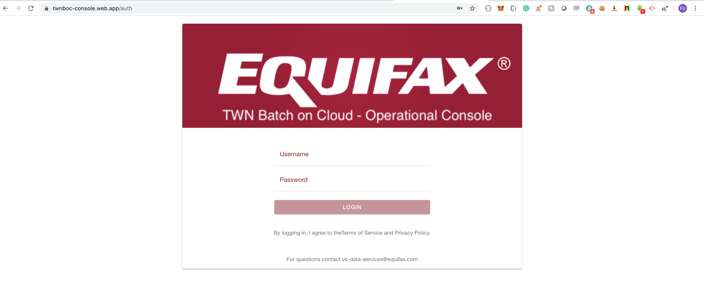
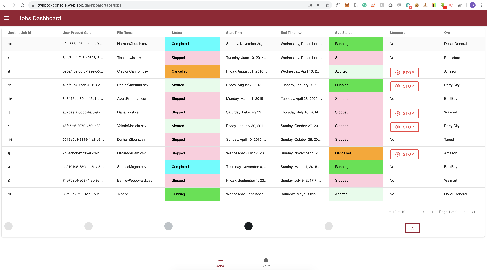
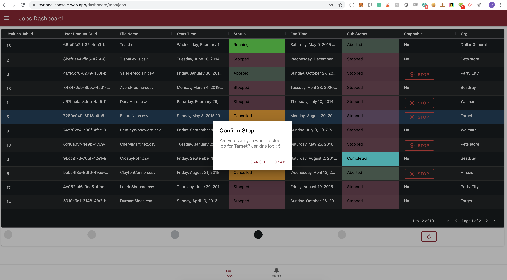

# TWNBOC Operational Console

## Instructions to run:

- Run npm install in the extracted project
- Run ng serve to start the local dev server

## Notes:
- Uses angularFire to integrate with Firestore.
- You need to configure your Firestore DB and API connetion detains in app.module.ts

#

#

#

